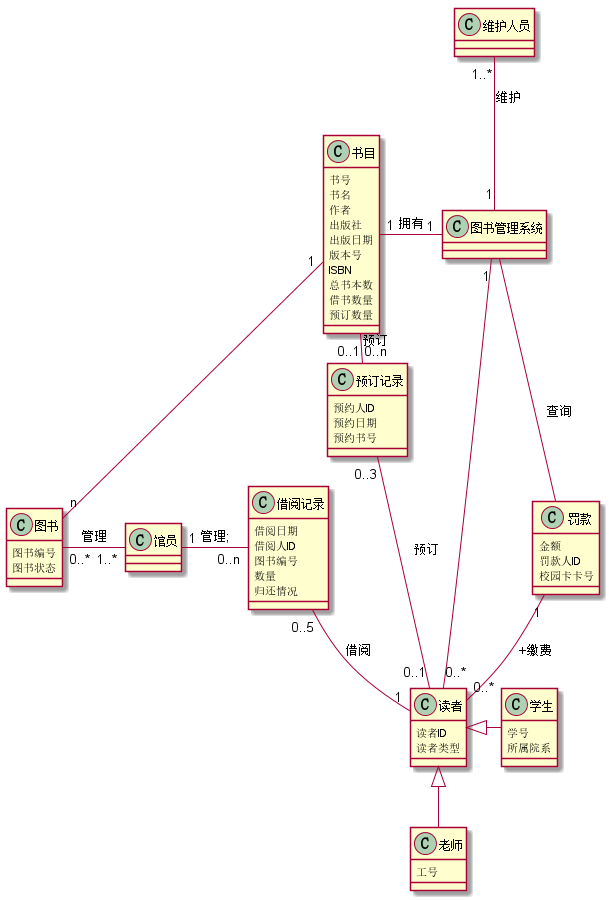
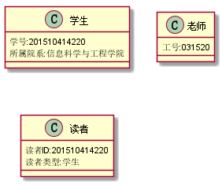

# 实验二：图书管理系统用例建模
学号|班级|姓名|
|:-------:|:-------------: | :----------:|
|201510414220|软件(本)15-2|巫恒强|

***
### ====== 以下为本次作业 ======
- - -
# 实验三：图书管理系统领域对象建模
## 1.图书管理系统的类图
### 1.1 图书管理系统的类图PlantUML源码如下：
    @startuml
    class 借阅记录{
        借阅日期
        借阅人ID
        图书编号
        数量
        归还情况
    }
    class 学生{
        学号
        所属院系
    }
    
    class 老师{
        工号
    }
    
    class 读者{
        读者ID
        读者类型
    }
    class 馆员
    class 罚款{
        金额
        罚款人ID
        校园卡卡号
    }
    class 图书管理系统
    class 维护人员
    class 预订记录{
        预约人ID
        预约日期
        预约书号
    }
    class 书目{
        书号
        书名
        作者
        出版社
        出版日期
        版本号
        ISBN
        总书本数
        借书数量
        预订数量
    }
    class 图书{
        图书编号
        图书状态
    }
    读者 <|-down-老师
    读者 <|-right- 学生
    借阅记录 "0..5" -down-"1" 读者:借阅
    
    图书管理系统 "1"-right-"0..*"读者
    读者 "0..1" -left- "0..3" 预订记录:预订
    借阅记录 "0..n" -left- "1" 馆员:管理;
    馆员 "1..*" -left-  "0..*"图书:管理
    罚款 "1"-- "0..*"读者:+缴费
    图书管理系统 -down- 罚款:查询
    图书管理系统 "1"-left-"1" 书目:拥有
    维护人员 "1..*" -down- "1" 图书管理系统:维护
    预订记录 "0..n" -left-  "0..1"书目:预订
    图书 "n" -up-  "1" 书目
    @enduml
### 1.2 图书管理系统的类图如下：

## 2.图书管理系统对象图
### 2.1 图书,书目 对象图如下：

    @startuml
    
    class 图书{
        图书编号:201103001
        图书状态:可借
    }
    class 书目{
        书号:9787040126614
        书名:信息系统分析与设计
        作者:赵卫东
        出版社:清华大学出版社
        出版日期:20151001
        版本号:第四版
        ISBN:978-302-32982-4
        总书本数:20
        借书数量:5
        预订数量:2
    }
    @enduml

### 2.2 借阅记录 对象图如下：
    @startuml
       class 借阅记录{
            借阅日期:20180410
            借阅人ID:201510414220
            图书编号:201103001
            数量:1
            归还情况:未还
        }
    @enduml

### 2.3 借阅记录 对象图如下：
    @startuml
    class 学生{
            学号:201510414220
            所属院系:信息科学与工程学院
        }
    
        class 老师{
            工号:031520
        }
    
        class 读者{
            读者ID:201510414220
            读者类型:学生
        }
    @enduml

### 2.4 借阅记录 对象图如下：
    @startuml
         class 罚款{
              金额:5.00
              罚款人ID:201510414220
              校园卡卡号:201510414220
         }
    @enduml
                  
  
### 2.4 预订记录 对象图如下：
    @startuml
       class 预订记录{
           预约人ID:201510414220
           预约日期:20180417
           预约书号:9787040126614
       }
    @enduml                
                    
  