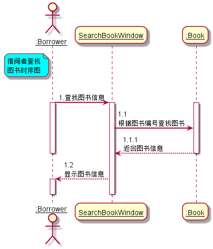
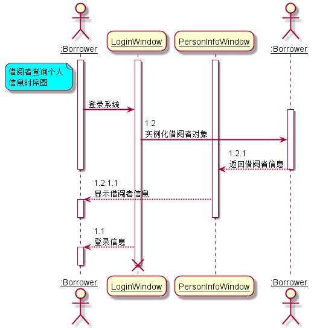
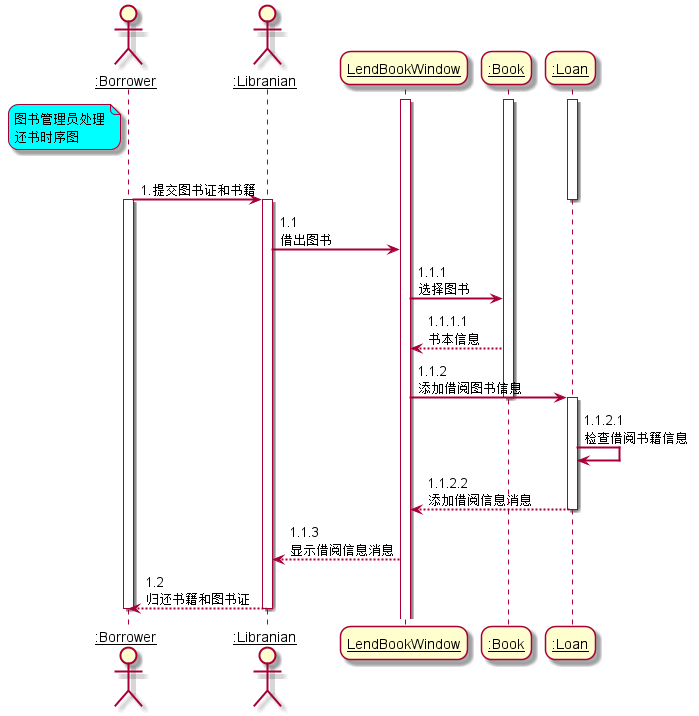
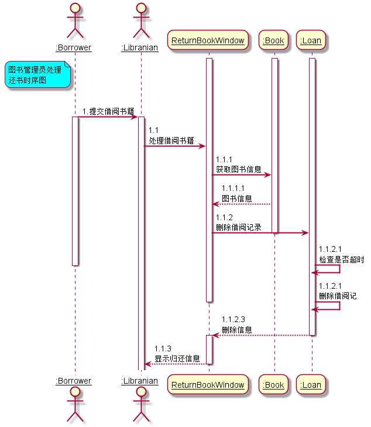

# 图书管理系统顺序图绘制
学号|班级|姓名|
|:-------:|:-------------: | :----------:|
|201510414220|软件(本)15-2|巫恒强|

***
### ====== 以下为本次作业 ======
- - -
# 实验四： 图书管理系统顺序图绘制
## 1.借阅者查找图书时序图
### 1.1 借阅者查找图书时序图PlantUML源码如下：
        @startuml
            skinparam sequenceArrowThickness 2
            skinparam roundcorner 20
            skinparam maxmessagesize 60
            skinparam sequenceParticipant underline
            
            actor ":Borrower" as User
            note left of User #aqua
                借阅者查找
                图书时序图
            end note
            participant "SearchBookWindow" as A
            participant ":Book" as B
            User -> A: 1.查找图书信息
            activate User
            activate A
            activate B
            A -> B: 1.1 根据图书编号查找图书
            B --> A: 1.1.1 返回图书信息
            deactivate User
            deactivate B
            A -->User:1.2 显示图书信息
            activate User
            deactivate User
            deactivate A
        @enduml
### 1.2 借阅者查找图书时序图如下：

## 2.借阅者查询个人信息时序图
### 2.1 借阅者查询个人信息时序图PlantUML源码如下：

       @startuml
           skinparam sequenceArrowThickness 2
           skinparam roundcorner 20
           skinparam maxmessagesize 60
           skinparam sequenceParticipant underline
           
           actor ":Borrower" as User
           note left of User #aqua
            借阅者查询个人
            信息时序图
           end note
           participant "LoginWindow" as A
           participant "PersonInfoWindow" as B
           actor ":Borrower" as C
             activate A
             activate B
             activate User
           User -> A: 登录系统
           activate C
           A -> C: 1.2 实例化借阅者对象
           C --> B: 1.2.1 返回借阅者信息
           deactivate User
           deactivate C
           B --> User: 1.2.1.1 显示借阅者信息
           activate User
           deactivate User
           deactivate B
           A --> User: 1.1 登录信息
           activate User
           deactivate User
           destroy A
       @enduml
### 2.2 借阅者查询个人信息时序图如下：

## 3.图书管理员处理借阅时序图
### 3.1 图书管理员处理借阅时序图PlantUML源码如下：
        @startuml
            skinparam sequenceArrowThickness 2
            skinparam roundcorner 20
            skinparam maxmessagesize 60
            skinparam sequenceParticipant underline
            
            actor ":Borrower" as User
            note left of User #aqua
                图书管理员处理
                还书时序图
            end note
            actor ":Libranian" as Lib
            participant "LendBookWindow" as A
            participant ":Book" as B
            participant ":Loan" as C
            activate A
            activate B
            activate C
            User -> Lib: 1.提交图书证和书籍
            deactivate C
            activate User
            activate Lib
            Lib -> A: 1.1 借出图书
            A -> B: 1.1.1 选择图书
            B --> A: 1.1.1.1  书本信息
            A -> C: 1.1.2  添加借阅图书信息
            deactivate B
            activate C
            C -> C:1.1.2.1 检查借阅书籍信息
            C --> A: 1.1.2.2  添加借阅信息消息
            deactivate C
            A -->Lib:1.1.3 显示借阅信息消息
            Lib -->User:1.2 归还书籍和图书证
            deactivate Lib
            deactivate User
        @enduml
### 3.2 图书管理员处理借阅时序图如下：

## 4.图书管理员处理还书时序图
### 4.1 图书管理员处理还书时序图PlantUML源码如下：
          @startuml
              skinparam sequenceArrowThickness 2
              skinparam roundcorner 20
              skinparam maxmessagesize 60
              skinparam sequenceParticipant underline
              
              actor ":Borrower" as User
              note left of User #aqua
                图书管理员处理
                还书时序图
              end note
              actor ":Libranian" as Lib
              participant "ReturnBookWindow" as A
              participant ":Book" as B
              participant ":Loan" as C
              activate A
              activate B
              activate C
              User -> Lib: 1.提交借阅书籍
              activate User
              activate Lib
              Lib -> A: 1.1 处理借阅书籍
              A -> B: 1.1.1 获取图书信息
              B --> A: 1.1.1.1  图书信息
              A -> C: 1.1.2  删除借阅记录
              deactivate B
              C -> C:1.1.2.1 检查是否超时
              deactivate User
              C -> C:1.1.2.1 删除借阅记
              deactivate A
              deactivate B
              C --> A: 1.1.2.3  删除信息
              deactivate C
              activate A
              A -->Lib:1.1.3 显示归还信息
              deactivate A
          @enduml
### 4.2 图书管理员处理还书时序图如下：
