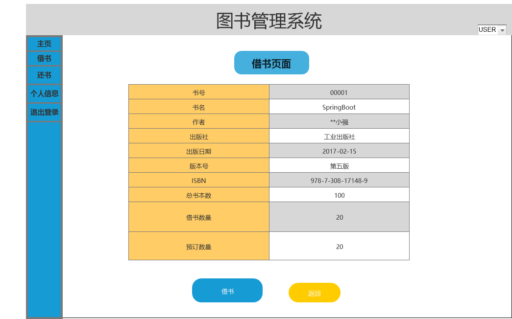

# 实验5 图书管理系统数据库设计与界面设计
学号|班级|姓名|
|:-------:|:-------------: | :----------:|
|201510414220|软件(本)15-2|巫恒强|

***
### ====== 以下为本次作业 ======
- - -
# 实验5 图书管理系统数据库设计与界面设计
## 1.数据库表设计
### 1.1 书目表：

|字段 |类型 |主键，外键 |可以为空 |默认值|约束|说明|
|:-------:|:-------------:|:------:|:----:|:---:|:----:|:-----|
|书号|varchar(100)|主键    |否| | | |
|书名|varchar(100)| 否  |否| | | |
|作者|varchar(100)|  否  |否|  |  |  |  
|出版社|varchar(100)| 否 |否| | | |
|出版日期|datetime|   否 |否| | | |
|版本号|varchar(100)| 否  |是|  |  |  |  
|ISBN|varchar(50)| 否|  否| | | |
|总书本数|int| 否 |否| | | |
|借书数量|int|   否|是|  |  |  |  
|预订数量|int|  否 |是|  |  |  |  

### 1.2 预订记录表：

|字段 |类型 |主键，外键 |可以为空 |默认值|约束|说明|
|:-------:|:-------------:|:------:|:----:|:---:|:----:|:-----|
|预约人ID|int|主键    |否| | | |
|预约日期|datetime|     否   |否| | | |
|预约书号|varchar(100)|  否  |否|  |  |  |  

### 1.3 图书表：

|字段 |类型 |主键，外键 |可以为空 |默认值|约束|说明|
|:-------:|:-------------:|:------:|:----:|:---:|:----:|:-----|
|图书编号|int|主键    |否| | | |
|图书状态|varchar(20)|     否   |否| | | |

### 1.4 馆员表：

|字段 |类型 |主键，外键 |可以为空 |默认值|约束|说明|
|:-------:|:-------------:|:------:|:----:|:---:|:----:|:-----|
|馆员ID|int|主键    |否| | | |
|馆员姓名|varchar(20)|     否   |否| | | |

### 1.5 借阅记录表：

|字段 |类型 |主键，外键 |可以为空 |默认值|约束|说明|
|:-------:|:-------------:|:------:|:----:|:---:|:----:|:-----|
|预约人ID|int|主键    |否| | | |
|预约日期|datetime|     否   |否| | | |
|预约书号|varchar(100)|  否 |否|  |  |  |  
### 1.6 罚款表：

|字段 |类型 |主键，外键 |可以为空 |默认值|约束|说明|
|:-------:|:-------------:|:------:|:----:|:---:|:----:|:-----|
|罚款人ID|int|主键    |否| | | |
|金额|float|     否   |否| | | |
|校园卡卡号|int|   否     |否|  |  |  |  

### 1.7 读者表：

|字段 |类型 |主键，外键 |可以为空 |默认值|约束|说明|
|:-------:|:-------------:|:------:|:----:|:---:|:----:|:-----|
|读者ID|int|主键    |否| | | |
|读者类型|varchar(20)|     否   |否| | | |

### 1.8 学生表：

|字段 |类型 |主键，外键 |可以为空 |默认值|约束|说明|
|:-------:|:-------------:|:------:|:----:|:---:|:----:|:-----|
|学号|int|主键    |否| | | |
|姓名|varchar(20)|     否   |否| | | |
|所属院系|varchar(20)|     否   |否| | | |

### 1.9 老师表：

|字段 |类型 |主键，外键 |可以为空 |默认值|约束|说明|
|:-------:|:-------------:|:------:|:----:|:---:|:----:|:-----|
|工号|int|主键    |否| | | |
|姓名|varchar(20)|     否   |否| | | |


## 2. 界面设计
## 2.1. 借书界面设计

  

- 用例图参见：借书用例
- 类图参见：借书类，读者类
- 顺序图参见：借书顺序图
- API接口如下：  

1.查询图书API
- 功能：用于获取图书所有信息
- 请求地址： http://localhost:8080/library/api/select
- 请求方法：POST
- 请求参数：

|参数名称|必填|说明|
|:-------:|:-------------: | :----------:|
|书号|是|书目表的主键,用于查询书目的全部信息,以隐藏域的方式传递 |
|method|是|固定为 “post”。|

- 返回实例：
```
{
    "info": "查询成功,返回信息",
    "data": {
        "nickname": "O记_Mega可达鸭",
        "uid": "14361",
        "signature": "呀  一不小心就进化了",
        "score1": "322",
        "real_nickname": "O记_Mega可达鸭",
        "title": "Lv3 转正",
        "avatar128": "http://upload.opensns.cn/Uploads_Avatar_14361_58e4b58fccf81.jpg?imageMogr2/crop/!260x260a6a22/thumbnail/128x128!",
        "avatar512": "http://upload.opensns.cn/Uploads_Avatar_14361_58e4b58fccf81.jpg?imageMogr2/crop/!260x260a6a22/thumbnail/512x512!"
    },
    "code": 200
}
```
- 返回参数说明：
    
|参数名称|说明|
|:-------:|:-------------: |
|Info|返回信息|
|data返回的图书信息|
|dodo|返回码|